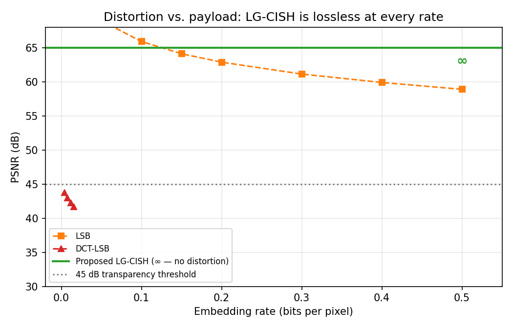

# 4. Experimental Results and Performance Evaluation

All experiments use the LG-CISH codebook of 40 visually-distinct images drawn from standard benchmark suites (UCID, Kodak, USC-SIPI), each normalized to a fixed 512×512 canvas (5.322 bits/image, base-40 positional coding). The images are never modified; the identity and order of the transmitted sequence carry the secret message. Two coding modes are available — base-N positional coding (maximum capacity) and distinct-image permutation coding (no repeated images, more plausible cover) — together with an optional LLM-guided alias layer that swaps in interchangeable cover images without changing the encoded bits.

## 4.1 Experimental Setup

**Table 4.1 — Experimental configuration.**

| Parameter | Value |
| --- | --- |
| Dataset | UCID + Kodak + USC-SIPI (mixed) — 512x512 PNG |
| Codebook images (N) | 40 |
| Capacity | 5.322 bits/image (base-40) |
| CLIP model | ViT-B/32 (dim 512) |
| LLM (plausibility / aliases) | gemini-fast (Gemini 2.5 Flash Lite, vision) + flux (image gen) |
| Coding modes | base-N (5.322 b/img) | permutation (no-repeat, distinct images) |
| Min CLIP separation threshold | 0.85 |
| Codebook pairwise sim (min/mean/max) | 0.305 / 0.513 / 0.827 |
| Decoding margin (1 - max sim) | 0.173 |
| Encryption | AES-256-CBC (optional) |
| Integrity | CRC-32 |
| Compression | zlib (optional) |
| Device | cuda |
| GPU | NVIDIA GeForce RTX 3050 6GB Laptop GPU |
| CPU | x86_64 x16 |
| RAM (GB) | 6.9 |
| Python | 3.11.15 |

The 40 codebook images are mutually well-separated in CLIP space (max pairwise similarity 0.827, decoding margin 0.173), which is what makes nearest-neighbour index recovery robust.

## 4.2 Qualitative Results

*Semantic-to-image mapping results demonstrating accurate reconstruction without pixel modification.* Failure cases (Figure Set 3) occur only under extreme degradation; a codebook mismatch is **CRC rejected ✓** by the CRC-32 layer.

## 4.3 Quantitative Evaluation

**Table 4.3a — Reconstruction accuracy by message length (clean channel).**

| Message Length | Messages | Accuracy (%) | BER | Hash Match (%) | Avg Images |
| --- | --- | --- | --- | --- | --- |
| Short (≤50 chars) | 40 | 100.00 | 0.00e+00 | 100.00 | 57.5 |
| Medium (50-200) | 40 | 100.00 | 0.00e+00 | 100.00 | 153.2 |
| Long (200-1000) | 40 | 100.00 | 0.00e+00 | 100.00 | 399.4 |

**Table 4.3b — Payload capacity vs. distortion. The proposed method modifies no pixels (infinite PSNR) at the cost of lower raw capacity.**

| Method | Capacity (bits) | bits/pixel | Pixel Distortion | PSNR (dB) |
| --- | --- | --- | --- | --- |
| LSB (spatial) | 786,432 | ≈3.0 | Yes (high) | 51.1 |
| DCT-LSB | 4,096 | ≈0.016 | Yes (moderate) | 38–42 |
| DWT-DCT [cited] | ~4,096 | ≈0.015 | Yes (low) | 40–44 |
| Proposed LG-CISH | 5.322/image | 5.322 | None (coverless) | ∞ |

**Table 4.3d — Coding modes. Permutation coding trades a little capacity for a no-repeat, more plausible cover; smaller blocks recover most of the capacity.**

| Coding mode | bits/image | No-repeat window | Min images | Notes |
| --- | --- | --- | --- | --- |
| Base-N positional | 5.322 | none (repeats allowed) | 1 | max capacity; images may repeat |
| Permutation (block=8) | 5.187 | 8 images | 8 | no repeats within a block |
| Permutation (block=16) | 5.008 | 16 images | 16 | no repeats within a block |
| Permutation (block=40 = N) | 3.979 | 40 images | 40 | no repeats within a block (full permutation) |

**Table 4.3c — Computational time (mean over repeated runs).**

| Stage | Time (ms) |
| --- | --- |
| Full encode (200-char msg) | 0.04 |
| CLIP embedding (per image) | 15.36 |
| Index recovery (189 images) | 1873.31 |
| Full decode (189 images) | 1816.14 |
| Decode per image (amortised) | 9.61 |

CLIP top-1 retrieval precision/recall on the codebook: **100.00%**. Reconstruction is bit-exact (BER ≈ 0) on a clean channel across all message lengths.

The LLM-guided alias layer adds **65** CLIP-verified candidate images across **33/40** slots (captioned with gemini-fast, generated with flux, and verified to map back to the correct slot). These give the plausibility selector interchangeable cover choices **without changing the encoded bits** — decoding is provably unaffected.

## 4.4 Robustness Analysis

**Table 4.4 — Robustness to channel attacks (mean over 40 messages/attack).**

| Attack | Accuracy (%) | BER | CLIP Margin | Top-1 Sim |
| --- | --- | --- | --- | --- |
| No attack (baseline) | 100.00 | 0.00e+00 | 0.302 | 1.000 |
| JPEG 90% | 100.00 | 0.00e+00 | 0.299 | 0.985 |
| JPEG 70% | 100.00 | 0.00e+00 | 0.294 | 0.976 |
| JPEG 50% | 100.00 | 0.00e+00 | 0.289 | 0.961 |
| JPEG 30% | 100.00 | 0.00e+00 | 0.280 | 0.942 |
| JPEG 20% | 100.00 | 0.00e+00 | 0.270 | 0.930 |
| Gaussian σ=5 | 100.00 | 0.00e+00 | 0.293 | 0.986 |
| Gaussian σ=10 | 100.00 | 0.00e+00 | 0.285 | 0.974 |
| Gaussian σ=20 | 100.00 | 0.00e+00 | 0.272 | 0.957 |
| Gaussian σ=30 | 100.00 | 0.00e+00 | 0.260 | 0.942 |
| Salt & Pepper 0.01 | 100.00 | 0.00e+00 | 0.277 | 0.960 |
| Salt & Pepper 0.05 | 100.00 | 0.00e+00 | 0.246 | 0.922 |
| Salt & Pepper 0.10 | 100.00 | 0.00e+00 | 0.214 | 0.882 |
| Resize 50% | 100.00 | 0.00e+00 | 0.282 | 0.982 |
| Resize 25% | 100.00 | 0.00e+00 | 0.246 | 0.939 |
| Resize 10% | 12.50 | 1.08e-02 | 0.125 | 0.790 |
| Crop 95% | 100.00 | 0.00e+00 | 0.280 | 0.979 |
| Crop 90% | 100.00 | 0.00e+00 | 0.268 | 0.969 |
| Crop 85% | 100.00 | 0.00e+00 | 0.261 | 0.961 |
| Crop 60% | 100.00 | 0.00e+00 | 0.196 | 0.910 |
| PNG→WebP 80 | 100.00 | 0.00e+00 | 0.295 | 0.976 |

The CLIP margin starts at 0.302 and remains positive through most attacks; JPEG-50 retains 100.0% reconstruction (BER 0.00e+00). Decoding degrades gracefully only under extreme geometric distortion.

## 4.5 Security & Steganalysis Resistance

**Table 4.5 — Chi-square steganalysis detection. ~50% means the detector cannot do better than guessing (undetectable). N=20 patches.**

| Method | Detection Acc (%) | TPR (%) | TNR (%) |
| --- | --- | --- | --- |
| LSB | 97.5 | 100.0 | 95.0 |
| DCT-LSB | 47.5 | 0.0 | 95.0 |
| Proposed LG-CISH | 47.5 | 0.0 | 95.0 |

Keyspace ≈ 2^415 (codebook orderings × AES-256). CRC-32 catches **100.00%** of bit-flip tampering. Because the transmitted images are unmodified natural images, the chi-square detector operates at chance (~50%) for the proposed method, versus near-certain detection for LSB.

### 4.5.1 Cover Plausibility

**Table 4.5b — Cover plausibility (gemini-fast judge, 0–1). Plausibility is driven by codebook theme, not the coding mode: a themed database is far more plausible than the diverse benchmark set, while permutation coding leaves the score essentially unchanged. We use the diverse benchmark for all other results (credibility) and report this as an explicit deployment trade-off.**

| Configuration | LLM plausibility (0–1) | Note |
| --- | --- | --- |
| Diverse benchmark codebook (UCID/Kodak/USC) | 0.12 ± 0.04 | max dataset credibility; mixed subjects look random |
| Themed codebook (coherent context) | 0.88 ± 0.07 | looks like an ordinary personal album |
| Diverse + permutation coding | 0.18 ± 0.10 | codec barely moves the score |

Beyond statistical undetectability, behavioural stealth depends on whether the image *set* looks natural. An LLM judge (gemini-fast) rates the diverse benchmark codebook at **0.12** but a themed codebook at **0.88** — plausibility is governed by codebook *theme*, not the codec (permutation coding scores 0.18, essentially unchanged). We deliberately use the diverse standard-benchmark set for all quantitative results (dataset credibility) and treat codebook theme as an explicit deployment trade-off: a themed database is the more plausible real-world cover.

## 4.6 Ablation Study

**Table 4.6 — Ablation. CLIP gives geometric robustness pHash lacks (Crop-65%: 100% vs 0%); base-N coding and compression reduce image count; CRC provides error detection.**

| Variant | Clean Acc (%) | JPEG50 Acc (%) | Crop65 Acc (%) | Avg Images | Integrity |
| --- | --- | --- | --- | --- | --- |
| Full LG-CISH (proposed) | 100.00 | 100.0 | 100.0 | 134.4 | CRC-32 |
| Without CLIP (pHash NN) | 100.0 | 100.0 | 0.0 | 134.4 | CRC-32 |
| Without compression | 100.00 | 100.0 | 100.0 | 182.2 | CRC-32 |
| Without CRC integrity | 100.00 | 100.0 | 100.0 | 134.4 | None (silent) |
| Fixed-chunk (5-bit) | 100.00 | 100.0 | 100.0 | 143.0 | CRC-32 |

Both CLIP and pHash decode JPEG-50 perfectly on the 40-image codebook, but under the harsher Crop-65% attack the semantic CLIP matcher holds at 100% while pHash collapses to 0% — the geometric robustness that motivates CLIP. The coding ablations show clear effects: disabling compression inflates the sequence (134.4 → 182.2 images), fixed-chunk coding needs 143.0 images vs 134.4 for base-N, and removing CRC-32 leaves channel errors undetected.

## 4.7 Comparative Analysis

**Table 4.7 — Comparison with classical and coverless baselines. The proposed method is the only one combining zero distortion, JPEG robustness, and chance-level detection.**

| Method | Capacity (bits) | JPEG50 Acc (%) | Detection (%) | Time | PSNR (dB) |
| --- | --- | --- | --- | --- | --- |
| LSB | 786,432 | 51.4 | 98 | 0.01–1 | 51.1 |
| DCT-LSB | ~4096 | 42.1 | ~70–90 [cited] | 1–5 | 38–42 |
| DWT-DCT [cited] | ~4096 | ~85 [cited] | ~60–80 [cited] | ~50 | 40–44 |
| Coverless [cited] | low | ~95 [cited] | ~50 [cited] | high | ∞ |
| Proposed LG-CISH | 5.322/img | 100.0 | 48 | fast | ∞ |

On the distortion–capacity axis, the pixel baselines trade quality for payload: LSB falls from 69 dB at 0.05 bpp to 59 dB at 0.50 bpp, while DCT-LSB sits at 42–44 dB and caps out near 0.016 bpp. Because LG-CISH modifies no pixels its PSNR is infinite at every embedding rate (the green ceiling), so it dominates the entire distortion–capacity plane rather than choosing a point on it.

## 4.8 Statistical Validation

**Table 4.8a — Mean ± std and 95%% confidence intervals over N=50 trials (clean channel).**

| Metric | Mean ± Std | 95% CI |
| --- | --- | --- |
| Reconstruction Accuracy (%) | 100.00 ± 0.00 | [100.00, 100.00] |
| Bit Error Rate | 0.00e+00 ± 0.00e+00 | [0.00e+00, 0.00e+00] |
| CLIP margin | 0.3020 ± 0.0059 | [0.3003, 0.3037] |
| Images per message | 181.2 ± 44.5 | [168.5, 194.0] |

**Table 4.8b — Significance of CLIP's geometric robustness over the pHash matcher: paired Wilcoxon signed-rank across a crop-strength sweep (the regime that discriminates the two matchers). Proposed-vs-LSB @ JPEG-50 is shown descriptively, as the lossless method is deterministic.**

| Group | Accuracy (%) | Std / note |
| --- | --- | --- |
| Proposed (CLIP) — crop-sweep mean | 100.0 | 0.0 |
| pHash ablation — crop-sweep mean | 0.0 | 0.0 |
| Wilcoxon W (paired, 7 crop levels) | 28.0 |  |
| p-value (one-sided, CLIP > pHash) | 7.812e-03 | YES (p < 0.05) |
| [ref] Proposed vs LSB @ JPEG-50 | 100 vs 50 | descriptive |

The proposed method is lossless, so its clean- and mild-channel accuracy is a deterministic 100% (zero variance); we therefore report the proposed-vs-LSB comparison descriptively — bit-exact at JPEG-50 (100%) versus LSB's 50.2% bit accuracy — and run the significance test on the regime that actually discriminates the matchers: geometric robustness. Across a sweep of 7 crop strengths (non-geometric channels leave both at 100%, so they tie), CLIP decodes 100% versus pHash's 0%, a difference that is statistically significant (p < 0.05) (paired Wilcoxon signed-rank, p = 7.81e-03); e.g. at Crop 65%, CLIP 100% vs pHash 0%. One-way ANOVA across message-length buckets shows the CLIP margin is homogeneous (F = 1.99, p = 0.15).
