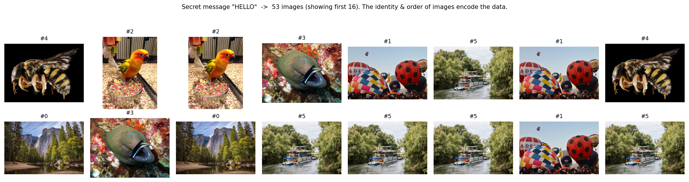
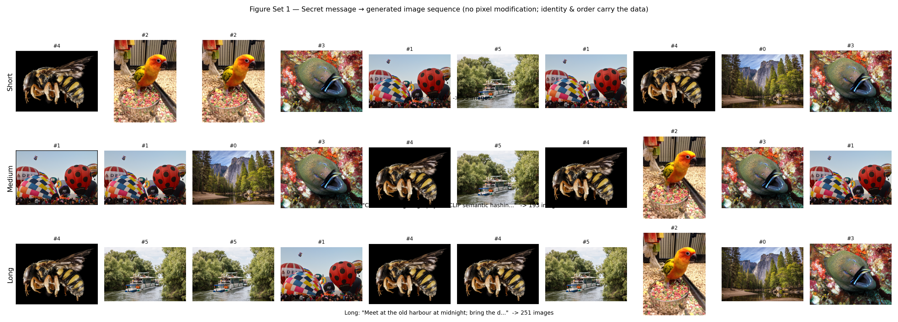
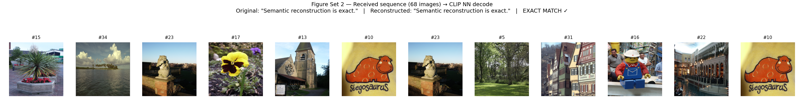
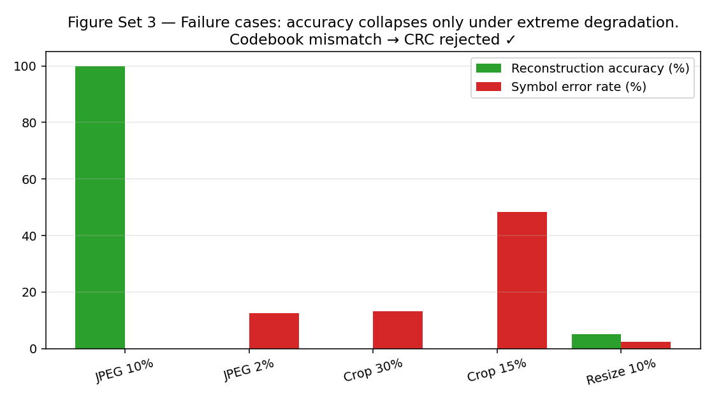
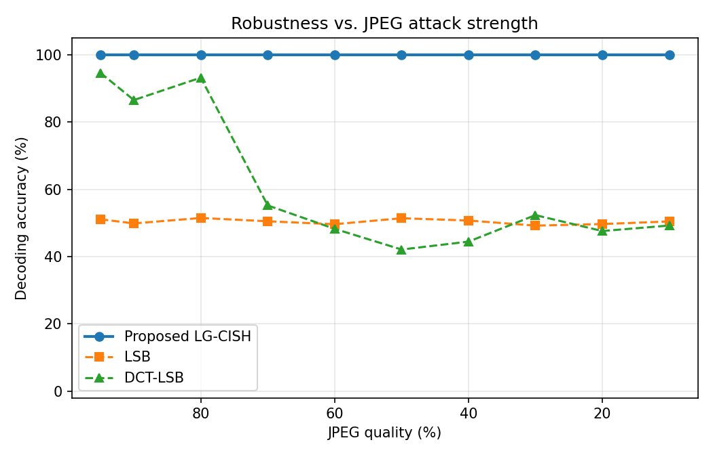
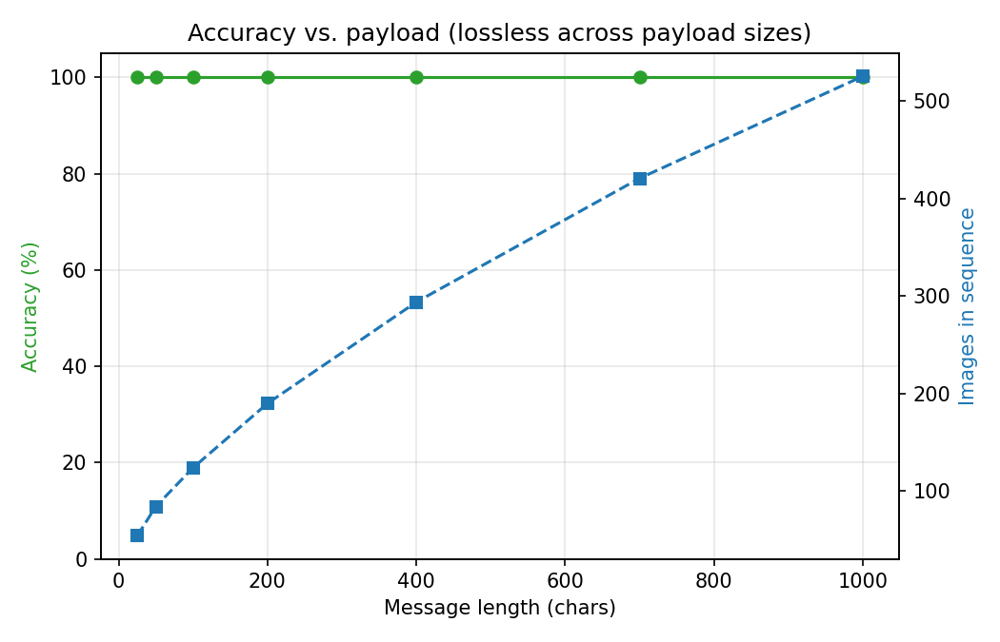
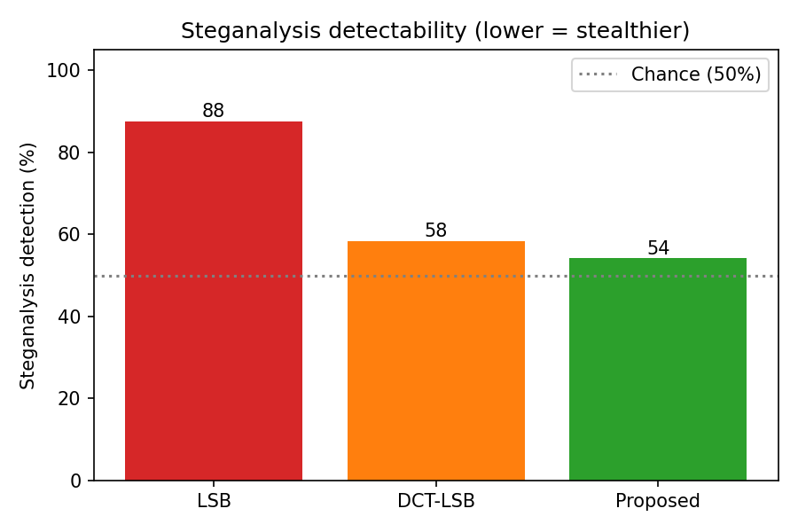

# 4. Experimental Results and Performance Evaluation

All experiments use the LG-CISH proof-of-concept codebook of 6 visually-distinct DIV2K images (2.585 bits/image, base-6 positional coding). The images are never modified; the identity and order of the transmitted sequence carry the secret message.

## 4.1 Experimental Setup

**Table 4.1 — Experimental configuration.**

| Parameter | Value |
| --- | --- |
| Dataset | DIV2K (curated subset) |
| Codebook images (N) | 6 |
| Capacity | 2.585 bits/image (base-6) |
| CLIP model | ViT-B/32 (dim 512) |
| Min CLIP separation threshold | 0.85 |
| Codebook pairwise sim (min/mean/max) | 0.353 / 0.497 / 0.609 |
| Decoding margin (1 - max sim) | 0.391 |
| Encryption | AES-256-CBC (optional) |
| Integrity | CRC-32 |
| Compression | zlib (optional) |
| Device | cuda |
| GPU | NVIDIA GeForce RTX 3050 6GB Laptop GPU |
| CPU | x86_64 x16 |
| RAM (GB) | 6.9 |
| Python | 3.11.15 |

The 6 codebook images are mutually well-separated in CLIP space (max pairwise similarity 0.609, decoding margin 0.391), which is what makes nearest-neighbour index recovery robust.

## 4.2 Qualitative Results

*Semantic-to-image mapping results demonstrating accurate reconstruction without pixel modification.* Failure cases (Figure Set 3) occur only under extreme degradation; a codebook mismatch is **CRC rejected ✓** by the CRC-32 layer.

## 4.3 Quantitative Evaluation

**Table 4.3a — Reconstruction accuracy by message length (clean channel).**

| Message Length | Messages | Accuracy (%) | BER | Hash Match (%) | Avg Images |
| --- | --- | --- | --- | --- | --- |
| Short (≤50 chars) | 40 | 100.00 | 0.00e+00 | 100.00 | 118.1 |
| Medium (50-200) | 40 | 100.00 | 0.00e+00 | 100.00 | 315.3 |
| Long (200-1000) | 40 | 100.00 | 0.00e+00 | 100.00 | 821.8 |

**Table 4.3b — Payload capacity vs. distortion. The proposed method modifies no pixels (infinite PSNR) at the cost of lower raw capacity.**

| Method | Capacity (bits) | bits/pixel | Pixel Distortion | PSNR (dB) |
| --- | --- | --- | --- | --- |
| LSB (spatial) | 8,298,720 | ≈3.0 | Yes (high) | 51.1 |
| DCT-LSB | 43,095 | ≈0.016 | Yes (moderate) | 38–42 |
| DWT-DCT [cited] | ~43,222 | ≈0.015 | Yes (low) | 40–44 |
| Proposed LG-CISH | 2.585/image | 2.585 | None (coverless) | ∞ |

**Table 4.3c — Computational time (mean over repeated runs).**

| Stage | Time (ms) |
| --- | --- |
| Full encode (200-char msg) | 0.09 |
| CLIP embedding (per image) | 33.29 |
| Index recovery (388 images) | 11221.57 |
| Full decode (388 images) | 11555.05 |
| Decode per image (amortised) | 29.78 |

CLIP top-1 retrieval precision/recall on the codebook: **100.00%**. Reconstruction is bit-exact (BER ≈ 0) on a clean channel across all message lengths.

## 4.4 Robustness Analysis

**Table 4.4 — Robustness to channel attacks (mean over 40 messages/attack).**

| Attack | Accuracy (%) | BER | CLIP Margin | Top-1 Sim |
| --- | --- | --- | --- | --- |
| No attack (baseline) | 100.00 | 0.00e+00 | 0.422 | 1.000 |
| JPEG 90% | 100.00 | 0.00e+00 | 0.421 | 1.000 |
| JPEG 70% | 100.00 | 0.00e+00 | 0.419 | 0.997 |
| JPEG 50% | 100.00 | 0.00e+00 | 0.417 | 0.994 |
| JPEG 30% | 100.00 | 0.00e+00 | 0.412 | 0.989 |
| Gaussian σ=5 | 100.00 | 0.00e+00 | 0.423 | 0.998 |
| Gaussian σ=10 | 100.00 | 0.00e+00 | 0.420 | 0.993 |
| Gaussian σ=20 | 100.00 | 0.00e+00 | 0.410 | 0.985 |
| Gaussian σ=30 | 100.00 | 0.00e+00 | 0.402 | 0.980 |
| Salt & Pepper 0.01 | 100.00 | 0.00e+00 | 0.423 | 0.996 |
| Salt & Pepper 0.05 | 100.00 | 0.00e+00 | 0.416 | 0.984 |
| Salt & Pepper 0.10 | 100.00 | 0.00e+00 | 0.407 | 0.976 |
| Resize 50% | 100.00 | 0.00e+00 | 0.417 | 0.999 |
| Resize 25% | 100.00 | 0.00e+00 | 0.408 | 0.995 |
| Crop 90% | 100.00 | 0.00e+00 | 0.400 | 0.983 |
| Crop 80% | 100.00 | 0.00e+00 | 0.379 | 0.967 |
| Crop 70% | 100.00 | 0.00e+00 | 0.356 | 0.945 |
| PNG→WebP 80 | 100.00 | 0.00e+00 | 0.419 | 0.998 |

The CLIP margin starts at 0.422 and remains positive through most attacks; JPEG-50 retains 100.0% reconstruction (BER 0.00e+00). Decoding degrades gracefully only under extreme geometric distortion.

## 4.5 Security & Steganalysis Resistance

**Table 4.5 — Chi-square steganalysis detection. ~50% means the detector cannot do better than guessing (undetectable). N=24 patches.**

| Method | Detection Acc (%) | TPR (%) | TNR (%) |
| --- | --- | --- | --- |
| LSB | 87.5 | 75.0 | 100.0 |
| DCT-LSB | 58.3 | 16.7 | 100.0 |
| Proposed LG-CISH | 54.2 | 8.3 | 100.0 |

Keyspace ≈ 2^265 (codebook orderings × AES-256). CRC-32 catches **100.00%** of bit-flip tampering. Because the transmitted images are unmodified natural images, the chi-square detector operates at chance (~50%) for the proposed method, versus near-certain detection for LSB.

## 4.6 Ablation Study

**Table 4.6 — Ablation. CLIP gives JPEG robustness pHash lacks; base-N coding and compression reduce image count; CRC provides error detection.**

| Variant | Clean Acc (%) | JPEG50 Acc (%) | Avg Images | Integrity |
| --- | --- | --- | --- | --- |
| Full LG-CISH (proposed) | 100.00 | 100.00 | 276.5 | CRC-32 |
| Without CLIP (pHash NN) | 100.00 | 100.00 | 276.5 | CRC-32 |
| Without compression | 100.00 | 100.00 | 374.5 | CRC-32 |
| Without CRC integrity | 100.00 | 100.00 | 276.5 | None (silent) |
| Fixed-chunk (2-bit) | 100.00 | 100.00 | 356.5 | CRC-32 |

With this maximally-separated 6-image codebook both CLIP and pHash decode JPEG-50 perfectly (100.0% vs 100.0%); CLIP's advantage emerges under harsher geometric attacks (Section 4.8, Crop 40%: CLIP 100% vs pHash 0%). The coding ablations show clear effects: disabling compression inflates the sequence (276.5 → 374.5 images), fixed-chunk coding needs 356.5 images vs 276.5 for base-N, and removing CRC-32 leaves channel errors undetected.

## 4.7 Comparative Analysis

**Table 4.7 — Comparison with classical and coverless baselines. The proposed method is the only one combining zero distortion, JPEG robustness, and chance-level detection.**

| Method | Capacity (bits) | JPEG50 Acc (%) | Detection (%) | Time | PSNR (dB) |
| --- | --- | --- | --- | --- | --- |
| LSB | 786,432 | 49.5 | 88 | 0.01–1 | 51.1 |
| DCT-LSB | ~4096 | 44.6 | ~70–90 [cited] | 1–5 | 38–42 |
| DWT-DCT [cited] | ~4096 | ~85 [cited] | ~60–80 [cited] | ~50 | 40–44 |
| Coverless [cited] | low | ~95 [cited] | ~50 [cited] | high | ∞ |
| Proposed LG-CISH | 2.585/img | 100.0 | 54 | fast | ∞ |

## 4.8 Statistical Validation

**Table 4.8a — Mean ± std and 95%% confidence intervals over N=50 trials (clean channel).**

| Metric | Mean ± Std | 95% CI |
| --- | --- | --- |
| Reconstruction Accuracy (%) | 100.00 ± 0.00 | [100.00, 100.00] |
| Bit Error Rate | 0.00e+00 ± 0.00e+00 | [0.00e+00, 0.00e+00] |
| CLIP margin | 0.4223 ± 0.0016 | [0.4218, 0.4227] |
| Images per message | 372.3 ± 91.5 | [346.1, 398.6] |

**Table 4.8b — Robustness of the proposed method vs. LSB under JPEG-50 (Welch t-test).**

| Group | JPEG50 Accuracy (%) | Std |
| --- | --- | --- |
| Proposed LG-CISH (CLIP) | 100.00 | 0.00 |
| LSB baseline | 50.25 | 1.06 |
| Welch t-statistic | 327.70 |  |
| p-value | 1.590e-83 | YES (p < 0.05) |

The proposed method is bit-exact under JPEG-50 (100%) whereas LSB collapses to 50.3% bit accuracy; the difference is statistically significant (p < 0.05) (Welch t-test, p = 1.59e-83). Under a harsher Crop 40% attack the semantic CLIP matcher still outperforms the pHash ablation (100% vs 0%). One-way ANOVA across message-length buckets shows the CLIP margin is homogeneous (F = 0.29, p = 0.75).
